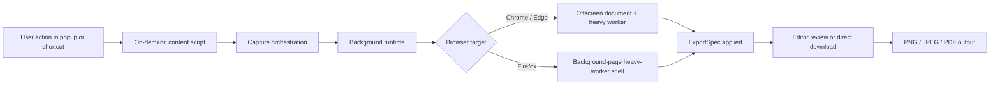
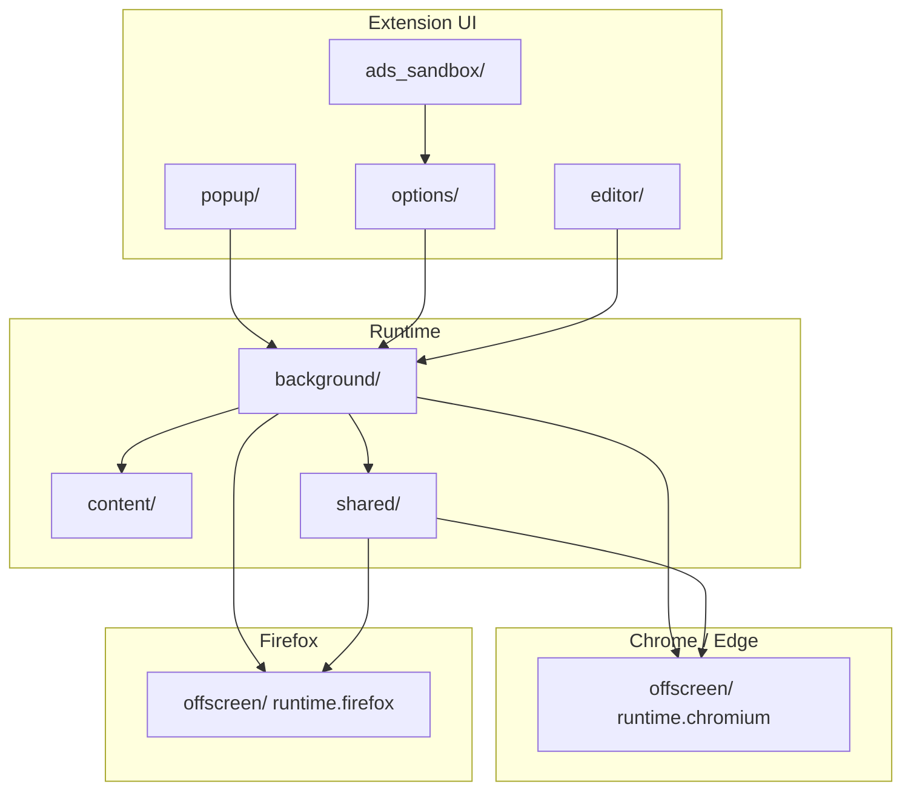
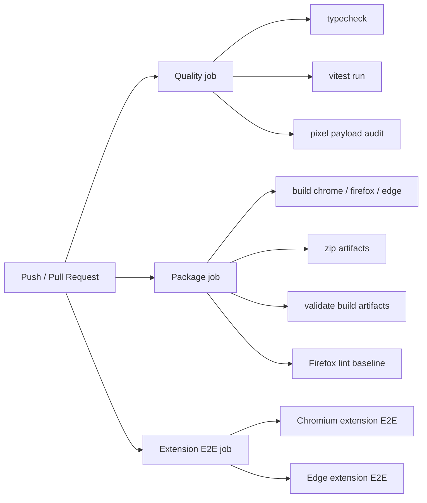

# SnapVault

**Deterministic screenshot exports for Chrome, Firefox, and Edge.**

SnapVault is a local-first browser extension that captures pages, regions, and full-page flows, then exports them to a spec you control. The product pitch is simple and verifiable in this repo:

- Predictable outputs: PNG, JPEG, and PDF exports shaped by reusable export presets.
- Local-first privacy: capture processing, stitching, and Pro redaction workflows run on-device.
- Cross-browser architecture: Chrome, Edge, and Firefox are built from one codebase with browser-specific runtime shells where needed.
- Release-grade validation: the repo includes unit tests, extension E2E coverage, packaging checks, and Firefox lint-baseline enforcement.

This repository contains the extension runtime, browser-specific packaging flow, local licensing service for development, test harnesses, and documentation for the shipped architecture.

## Why SnapVault

Most screenshot tools stop at “take a picture.” SnapVault is built around **deterministic export workflows**:

- Capture visible pages, regions, full pages, and scrollable surfaces.
- Export with preset dimensions, format, and DPI policy.
- Keep sensitive workflows offline with local processing and optional Pro-only redaction tooling.
- Validate builds like a real browser product, not just a web app bundle.

## What The Repo Actually Ships

### Free tier

- Visible capture
- Region capture
- Full-page scroll + stitch
- PNG, JPEG, and PDF export
- Export presets and preset import/export
- Local recent-captures cache with expiry controls
- “Nuke everything” privacy reset
- HiDPI detection with an upgrade prompt for normalized 1x export

### Pro-oriented capabilities already modeled in the codebase

- Clean Capture
- DOM element isolation
- True 1x export / HiDPI normalization
- DOM-assisted and local-ML redaction workflow
- Multi-capture board workflow
- Local Stripe-backed licensing flow for development

## Browser Support

| Browser | Runtime strategy | Manifest | Repo support |
| --- | --- | --- | --- |
| Chrome | Service worker + offscreen document | MV3 | `npm run build:chrome` |
| Edge | Service worker + offscreen document | MV3 | `npm run build:edge` |
| Firefox | Background-page-compatible shell | MV2 | `npm run build:firefox` |

The browser split is implemented in [`wxt.config.ts`](./wxt.config.ts) with compile-time browser-family wiring in [`src/background/background-shell.ts`](./src/background/background-shell.ts), [`src/shared/offscreen-adapter.ts`](./src/shared/offscreen-adapter.ts), and [`src/offscreen/runtime.ts`](./src/offscreen/runtime.ts).

## Workflow Diagram



This is the central product loop in the repo: user-triggered capture, browser-aware heavy processing, and deterministic export.

## Architecture Diagram



### Runtime truth

- Chrome and Edge use an offscreen-document path for heavy canvas, stitching, encoding, and ML-related work.
- Firefox uses a compatible background-page path instead of `chrome.offscreen`.
- Shared logic stays in `src/shared/`, while browser-specific bootstraps live in `src/background/` and `src/offscreen/`.

## GitHub Actions And Release Flow

The repo includes a real CI matrix in [`.github/workflows/browser-matrix.yml`](./.github/workflows/browser-matrix.yml).



## Tech Stack

| Concern | Repo choice | Evidence |
| --- | --- | --- |
| Extension build system | WXT `0.20.19` | [`package.json`](./package.json), [`wxt.config.ts`](./wxt.config.ts) |
| UI layer | Preact `^10.29.0` | [`package.json`](./package.json) |
| Language | TypeScript | [`tsconfig.json`](./tsconfig.json) |
| Unit test runner | Vitest `^3.2.4` | [`package.json`](./package.json) |
| Extension/browser E2E | Playwright `^1.54.2` | [`package.json`](./package.json), [`e2e/`](./e2e/) |
| Firefox packaging checks | `web-ext` `^8.10.0` | [`package.json`](./package.json) |
| PDF generation | `pdf-lib` `^1.17.1` | [`package.json`](./package.json) |
| Local ML inference | `@huggingface/transformers` `^3.8.1` + local ONNX/WASM assets | [`package.json`](./package.json), [`public/assets/ml/`](./public/assets/ml/) |
| Licensing backend | Stripe `^18.4.0` in local dev service | [`services/licensing/package.json`](./services/licensing/package.json), [`services/licensing/`](./services/licensing/) |

## Security And Privacy Position

The repo is intentionally opinionated here:

- Capture requires user action.
- Pixel-processing stays in local browser/runtime surfaces.
- ML model assets are bundled locally.
- Firefox and Chromium take different runtime paths, but the privacy contract is the same.
- Test and audit flows explicitly check for unwanted network behavior during capture/export flows.

Read more:

- [`docs/SECURITY_PRIVACY.md`](./docs/SECURITY_PRIVACY.md)
- [`docs/ML_REDACTION.md`](./docs/ML_REDACTION.md)
- [`docs/API_SPECIFICATIONS.md`](./docs/API_SPECIFICATIONS.md)

## Repo Layout

```text
src/
  background/     Browser-aware orchestration
  content/        On-demand content script behaviors
  editor/         Annotation and export review UI
  options/        Presets, privacy controls, sponsor surface
  popup/          Fast capture entrypoint
  offscreen/      Chromium + Firefox heavy-work runtime shells
  shared/         Browser-agnostic core logic and adapters
services/
  licensing/      Local Stripe-backed licensing service for dev
e2e/              Extension E2E suites
tests/            Vitest unit coverage
docs/             Product, architecture, testing, and security docs
public/assets/ml/ Bundled ONNX + WASM assets for local redaction
```

## Getting Started

### Prerequisites

- Node.js 20+
- npm
- A Chromium browser for local extension testing
- Firefox if you want to validate the Firefox package/runtime path locally

### Install

```bash
npm install
```

### Run in development

```bash
npm run dev:chrome
npm run dev:edge
npm run dev:firefox
```

### Build production packages

```bash
npm run build:chrome
npm run build:edge
npm run build:firefox
```

### Build all targets

```bash
npm run build:all
```

### Configure licensing for real extension builds

```bash
# Example production build
set SNAPVAULT_LICENSING_BASE_URL=https://snapvault.app
npm run build:chrome
```

The extension no longer falls back to `127.0.0.1`. Checkout and sync require an explicit licensing base URL at build time.

## Verification Commands

These commands are directly defined in [`package.json`](./package.json):

```bash
npm run typecheck
npm run test:run
npm run test:e2e:extension:chromium
npm run test:e2e:extension:edge
npm run test:firefox:package
```

For packaged outputs:

```bash
npm run zip:chrome
npm run zip:edge
npm run zip:firefox
```

## Product Documentation Map

If you want the repo beyond the landing-page pitch, start here:

- [`docs/PRD.md`](./docs/PRD.md) — product vision, tiers, browser targets, scope
- [`docs/TECHNICAL_ARCHITECTURE.md`](./docs/TECHNICAL_ARCHITECTURE.md) — component map and runtime design
- [`docs/TESTING_QA.md`](./docs/TESTING_QA.md) — quality gates, CI matrix, E2E expectations
- [`docs/SECURITY_PRIVACY.md`](./docs/SECURITY_PRIVACY.md) — threat model and privacy rules
- [`docs/ML_REDACTION.md`](./docs/ML_REDACTION.md) — local ML redaction design
- [`docs/FIREFOX_LINT_BASELINE.md`](./docs/FIREFOX_LINT_BASELINE.md) — approved Firefox packaging warnings

## Why This README Is Different

This page is intentionally written like a product pitch, but every major claim is tied back to something verifiable in the repo:

- commands in `package.json`
- workflow definitions in `.github/workflows`
- architecture in `src/` and `docs/`
- model/runtime assets in `public/assets/ml/`
- browser packaging in `wxt.config.ts`

If you want to review SnapVault as a product, a codebase, or a release candidate, this repository now supports all three views.
